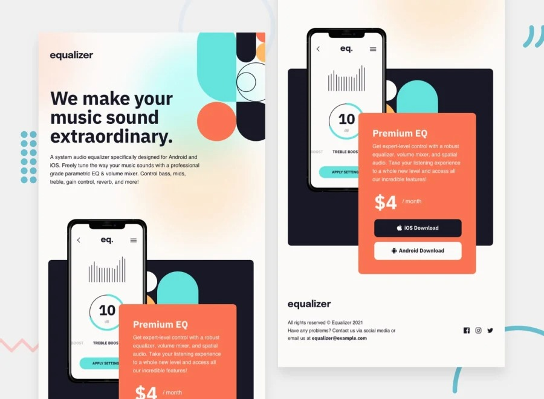
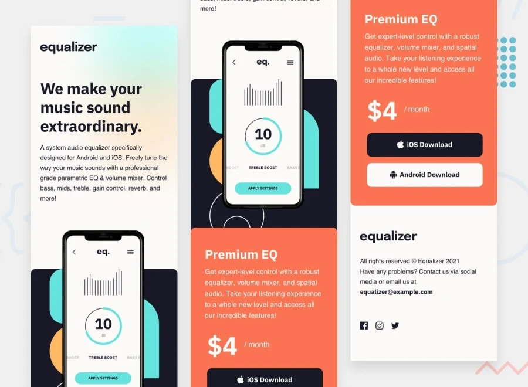
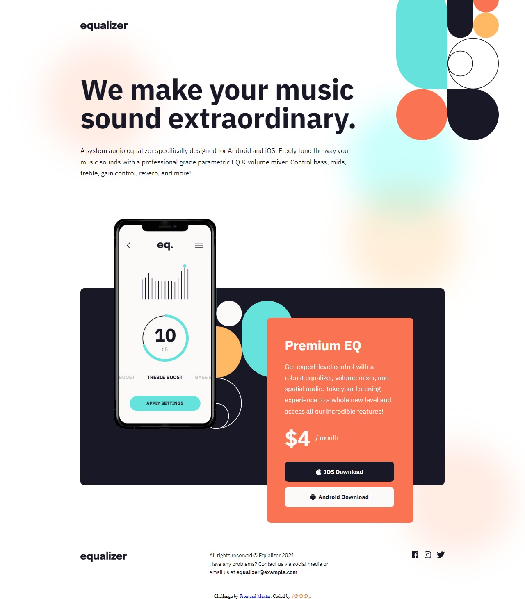

# Frontend Mentor - Equalizer-landing-page

This is my solution to the [Equalizer-landing-page challenge on Frontend Mentor](https://www.frontendmentor.io/challenges/equalizer-landing-page-7VJ4gp3DE). Frontend Mentor challenges help you improve your coding skills by building realistic projects.

## Table of contents

- [Overview](#overview)
- [The challenge](#the-challenge)
- [Screenshot](#screenshot)
- [Links](#links)
- [Author](#author)

## Overview

Designer's request for desktop :

Responsive tablet design :

Responsive mobile design :

### The challenge

Users should be able to:

- View the optimal layout depending on their device's screen size
- See hover states for interactive elements

### Screenshot

### Links

- Solution URL: (https://github.com/DavidDelannoyDeveloppement/2P-equalizer-landing-page)
- Live Site URL: (https://daviddelannoydeveloppement.github.io/2P-equalizer-landing-page/)

## Author

- Website - [DavidDelannoyDeveloppement](https://daviddelannoydeveloppement.github.io/DDD/index.html)
- Frontend Mentor - [@DavidDelannoyDeveloppement](https://www.frontendmentor.io/profile/DavidDelannoyDeveloppement)
- Github - [DavidDelannoyDeveloppement](https://github.com/DavidDelannoyDeveloppement)
